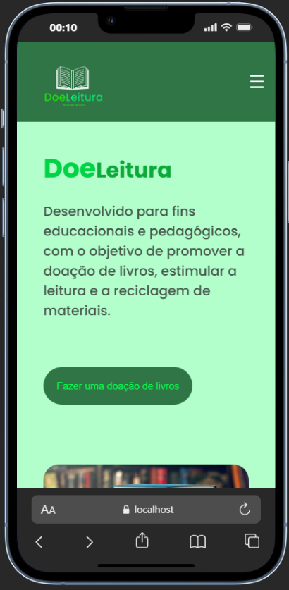
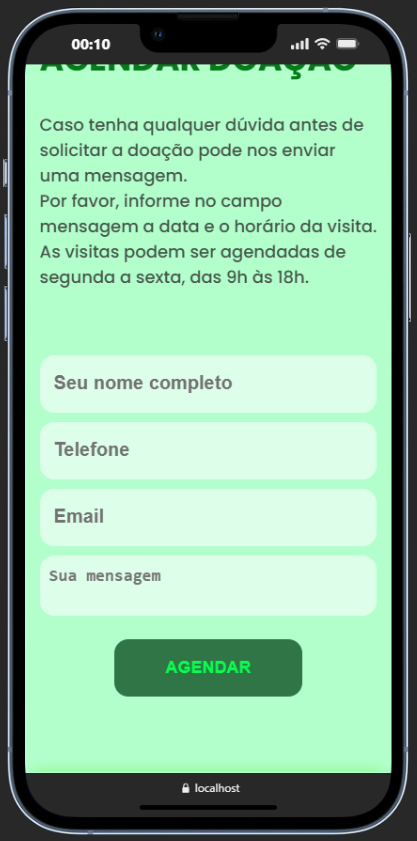
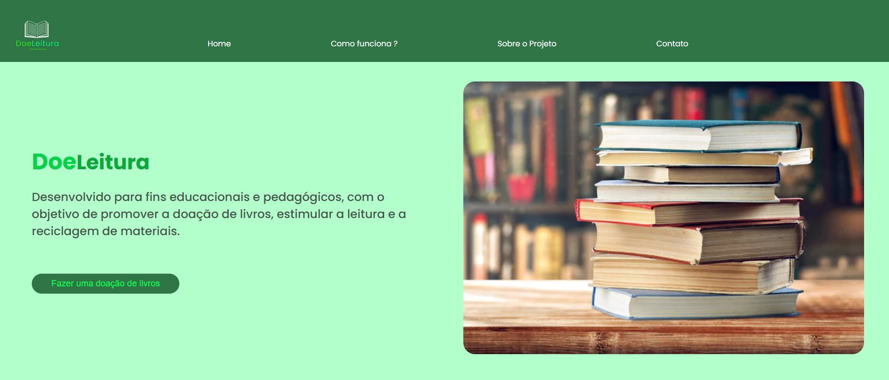

<h1 align="center" style="font-weight: bold;">DoeLeitura 📚</h1>

<p align="center">
 <a href="#sobre">Sobre</a> • 
 <a href="#tecnologias">Tecnologias</a> • 
 <a href="#como-rodar">Como Rodar</a> • 
 <a href="#preview">Preview</a> 
</p>

<h2 id="sobre">📋 Sobre o Projeto</h2>

O **DoeLeitura** é um trabalho acadêmico desenvolvido com o objetivo de criar um site de doação de livros para uma escola municipal.  
A ideia central é **incentivar a reutilização de livros** que estão parados, dando-lhes novos destinos:  

- 📖 **Livros em bom estado**: serão doados para os alunos da instituição.  
- ♻️ **Livros danificados**: serão destinados para reciclagem.  

Esse projeto busca promover a **sustentabilidade**, o **acesso à leitura** e a **valorização da educação** dentro da comunidade escolar.

<h2 id="tecnologias">💻 Tecnologias</h2>

<div>
  
  <span>HTML</span>
</div>
<div>
  
  <span>CSS</span>
</div>
<div>
  
  <span>JavaScript</span>
</div>
<div>
  
  <span>PHP</span>
</div>


<h2 id="como-rodar">🚀 Como Rodar</h2>

1️ Clone o repositório:  
```bash
git clone https://github.com/Dieegoo13/DoeLeitura
````
2️⃣ Instale um servidor local
Baixe e instale XAMPP ou WAMP

<h2 id="preview">📸 Preview do Projeto</h2>

Tela Home Page Mobile:
  

Tela Formulário Mobile:
  

Tela Desktop:
  


